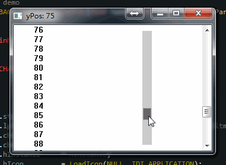

# VC界面控件 - 滚动条ScrollBar

界面是人机交互的门户，对产品至关重要。在界面开发中只有想不到没有做不到的，有好的想法，当然要尝试着做出来。对滚动条的扩展，现在有很多类是的例子。

**VS2015**的代码编辑是非常强大的，其中有一个功能可以把滚动态变成[**MinMap**][scrollbar]，可以通过<kbd>Options</kbd>-><kbd>Text Editor</kbd>-><kbd>C/C++</kbd>-><kbd>Scroll Bars</kbd>中的`Behavior`选项分类进行打开。

**sublime**也有这个功能，但没有**VS**的好用。变成[MinMap][scrollbar]后整个代码文档变成一个完整的缩微图，在你对代码比较熟悉的情况下，可以非常容易判断并定位到大致的函数位置。同时对特殊状态，如：错误信息，更新信息等进行标识。只要看一眼滚动条就能知道当前文档的情况，可以快速定位到相关文档位置。

> **优点多多：** 当一个文件内容比较长时，在上面标注相关重要内容是非常方便的。用于只要一看滚动条上的相关标示，就能知道相关信息。不用再开辟窗口告诉用户，他想得到的有关信息。

有**VS**可作参考，做这个就比较容易。不知道微软有没有注册版权-_-!!。因此想到扩展[**Scroll Bar**][scrollbar]是个不错的主意，但windows系统并没有给这个机会，一般的窗口类都自带系统滚动条。系统自带的完全无法做出这种效果，只能自己做一个覆盖系统默认滚动条。

**最终的效果：**

[详细内容 moguf.com](http://dev.moguf.com/post/testscrollcalc)
